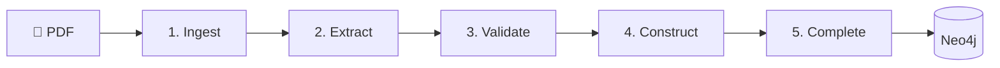
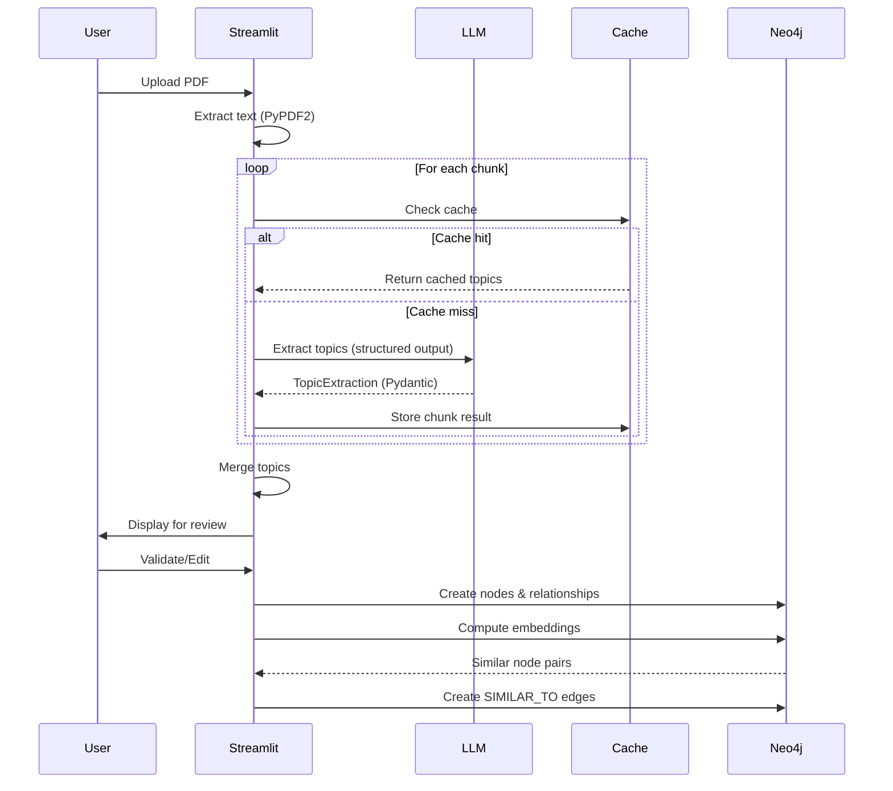
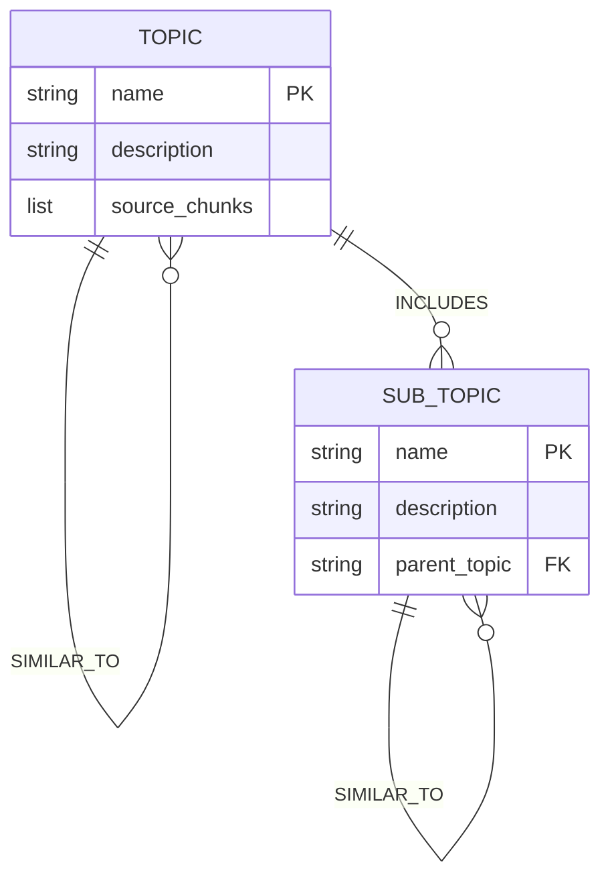

# LLM-Assisted Knowledge Graph Completion for Curriculum Analysis

Undergraduate thesis project exploring how Large Language Models (LLMs) can automate the extraction and enrichment of knowledge graphs from Indonesian curriculum documents (Capaian Pembelajaran).

## Abstract

Knowledge graphs provide structured representations of educational content, enabling curriculum analysis, learning path recommendations, and content alignment. This project implements a five-stage pipeline that:

1. Extracts topics and sub-topics from curriculum PDFs using LLMs with **structured output** via Pydantic schemas
2. Constructs a knowledge graph in Neo4j
3. Discovers missing relationships through **semantic similarity** using embeddings

The key innovation is using **LlamaIndex's `LLMTextCompletionProgram`** to enforce validated, typed output from LLMs—eliminating fragile regex/JSON parsing.

## Pipeline



| Step | Module | Input → Output |
|------|--------|----------------|
| 1. Ingest | `ingestion.py` | PDF → raw text |
| 2. Extract | `extraction.py` | Text → Topics/SubTopics (Pydantic) |
| 3. Validate | `app.py` | Human review & edit (skippable) |
| 4. Construct | `graph.py` | Validated data → Neo4j nodes |
| 5. Complete | `completion.py` | Embeddings → SIMILAR_TO edges |
| — | `experiments.py` | Save & compare experiment runs |

## Detailed Architecture

```mermaid
flowchart LR
    subgraph Input
        PDF[Curriculum PDF]
    end

    subgraph "1. Ingestion"
        A[PyPDF2] --> Raw[Raw Text]
    end

    subgraph "2. Extraction"
        Raw --> B[SentenceSplitter]
        B --> Chunks[Token-aware Chunks]
        Chunks --> C[LLMTextCompletionProgram]
        C --> |"Pydantic Schema"| Topics[Structured Topics]
    end

    subgraph "3. Validation"
        Topics --> D[Human Review]
        D --> Valid[Validated Data]
    end

    subgraph "4. Construction"
        Valid --> E[Neo4j Driver]
        E --> KG[(Knowledge Graph)]
    end

    subgraph "5. Completion"
        KG --> F[Embedding Model]
        F --> Emb[Node Embeddings]
        Emb --> G[Cosine Similarity]
        G --> NewEdges[New Relationships]
        NewEdges --> KG
    end

    PDF --> A
```



## Pipeline Overview



## Knowledge Graph Schema



## Tech Stack

| Layer | Technology | Purpose |
|-------|------------|---------|
| UI | Streamlit | Interactive web interface |
| LLM Orchestration | LlamaIndex | Chunking, structured output, embeddings |
| LLM Backend | LiteLLM | Multi-provider abstraction (Gemini, GPT-4o, Claude) |
| Validation | Pydantic | Schema enforcement for LLM output |
| Graph Database | Neo4j Aura | Knowledge graph storage & querying |
| PDF Parsing | PyPDF2 | Text extraction from curriculum PDFs |

## Key Design Decisions

### 1. Structured Output via Pydantic

Instead of prompting the LLM to return JSON and parsing it with regex, we use LlamaIndex's `LLMTextCompletionProgram`:

```python
from src.schemas import TopicExtraction

program = LLMTextCompletionProgram.from_defaults(
    llm=llm,
    output_cls=TopicExtraction,
    prompt_template_str=PROMPT,
)
result: TopicExtraction = program(text=chunk)  # Guaranteed valid
```

### 2. Disk-Based Caching

Extraction results are cached with SHA-256 keys:

```
data/cache/
├── a1b2c3d4e5f6...json       # Final merged result
├── a1b2c3d4e5f6..._chunk0.json  # Per-chunk cache
├── a1b2c3d4e5f6..._chunk1.json
└── ...
```

This enables:
- Resuming interrupted extractions (rate limits)
- Reusing results across sessions
- A/B testing different models

### 3. Multi-Provider Support

All LLM/embedding calls go through LiteLLM:

```python
# config.py
MODEL_CHOICES = {
    "Gemini 2.5 Flash": "gemini/gemini-2.5-flash",
    "GPT-4o Mini": "openai/gpt-4o-mini",
    "Claude 3.5 Haiku": "anthropic/claude-3-5-haiku-latest",
}
```

### 4. Experiment Tracking

Each extraction run can be saved as an experiment with:
- Model and prompt configuration
- Graph quality metrics (ADC, modularity, density)
- Topic/subtopic counts
- Similarity threshold and pair counts

Experiments are stored as JSON in `data/experiments/` for later comparison.

## Setup

```bash
# Install dependencies
pip install -e .

# Copy environment template
cp .env.example .env

# Edit .env with your credentials
# Required: GOOGLE_API_KEY, OPENAI_API_KEY, NEO4J_URI, NEO4J_PASSWORD
```

## Run

```bash
streamlit run app.py
```

## Project Structure

```
src/
├── ingestion.py      # PDF → text extraction
├── extraction.py     # LLM-based topic extraction with caching
├── graph.py          # Neo4j operations
├── completion.py     # Embedding-based similarity detection
├── schemas.py        # Pydantic models (TopicExtraction, Topic, SubTopic)
├── llama_setup.py    # LLM/embedding model factories
├── config.py         # Environment & model registries
├── prompts.py        # Modular prompt system for extraction
├── experiments.py    # Experiment tracking and comparison
└── health.py         # System health checks
```

## Performance Optimizations

The app includes several optimizations for handling large extractions:

### Cached Graph Metrics
Graph statistics and quality metrics (ADC, modularity, density) are cached for 60 seconds using `@st.cache_data`, avoiding expensive Neo4j queries and NetworkX computations on every interaction.

### Fragment-Based Validation UI
The Step 5 validation UI uses Streamlit's `@st.fragment` decorator, allowing button clicks to rerun only the validation section instead of the entire page.

### Lazy Loading Options
- **Step 3 (Validate & Edit)**: Editing UI is hidden by default. Users see topic/subtopic counts first and can choose to load the full editor only if needed.
- **Step 5 (KG Completion)**: Option to skip manual validation and save all pairs directly.
- **KG Explorer**: Collapsed by default with a manual refresh button.

## Thesis Context

This project demonstrates:

1. **LLM Reliability**: How structured output schemas eliminate parsing errors
2. **Pipeline Resilience**: Caching strategies for rate-limited APIs
3. **Knowledge Engineering**: Converting unstructured educational documents to queryable graphs
4. **Semantic Completion**: Using embeddings to discover implicit relationships
5. **Experiment Reproducibility**: Tracking and comparing extraction runs across different configurations

---

*Undergraduate thesis, 2025. LLM-Assisted Knowledge Graph Completion for Curriculum Analysis.*
