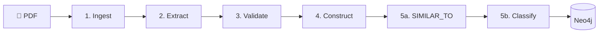
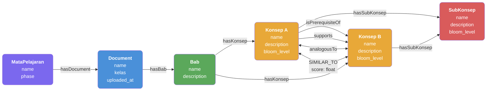

# LLM-Assisted Knowledge Graph Completion for Curriculum Analysis

Undergraduate thesis project exploring how Large Language Models (LLMs) can automate the extraction and enrichment of knowledge graphs from Indonesian curriculum documents (Capaian Pembelajaran — Kurikulum Merdeka).

## Abstract

Knowledge graphs provide structured representations of educational content, enabling curriculum analysis, learning path recommendations, and content alignment. This project implements a five-stage pipeline that:

1. Extracts concepts (*Konsep*) and sub-concepts (*SubKonsep*) from curriculum PDFs using LLMs with **structured output** via Pydantic schemas, including Bloom's taxonomy levels
2. Constructs a knowledge graph in Neo4j following a curriculum-aligned ontology
3. Discovers missing relationships through **semantic similarity** using embeddings
4. **Classifies** similar concept pairs into typed relationships (`isPrerequisiteOf`, `supports`, `analogousTo`) using a second LLM pass

The key anti-silo signal is the `analogousTo` relationship — cross-subject concept pairs (e.g., Fisika ↔ Kimia) that share the same structural pattern, enabling interdisciplinary curriculum analysis.

## Pipeline



| Step | Module | Input → Output |
|------|--------|----------------|
| 1. Ingest | `ingestion.py` | PDF → raw text |
| 2. Extract | `extraction.py` | Text → Konsep/SubKonsep + bloom_level (Pydantic) |
| 3. Validate | `app.py` | Human review & edit (skippable) |
| 4. Construct | `graph.py` | Validated data → Neo4j nodes/edges |
| 5a. Discover | `completion.py` | Embeddings → `SIMILAR_TO` edges |
| 5b. Classify | `completion.py` | LLM → typed relationship edges |
| — | `experiments.py` | Save & compare experiment runs |

## Knowledge Graph Ontology



### Node Types

| Node | Key Properties | Description |
|------|---------------|-------------|
| `MataPelajaran` | `name`, `phase` | Subject (Fisika/Kimia/Biologi), Fase E or F |
| `Document` | `name`, `kelas` | Textbook PDF, Kelas X/XI/XII |
| `Bab` | `name` | Chapter detected from text |
| `Konsep` | `name`, `description`, `bloom_level` | Main concept (was: Topic) |
| `SubKonsep` | `name`, `description`, `bloom_level` | Sub-concept (was: SubTopic) |

### Relationship Types

| Relationship | Type | Meaning |
|-------------|------|---------|
| `hasDocument`, `hasBab`, `hasKonsep`, `hasSubKonsep` | Structural | Curriculum hierarchy |
| `isPrerequisiteOf` | Typed | "Must learn A before B" |
| `supports` | Typed | "A helps with / is applied in B" |
| `analogousTo` | Typed | "A and B share the same pattern" — key anti-silo signal |
| `SIMILAR_TO {score}` | Discovery | Raw embedding similarity (classified into typed rels) |

### Bloom's Taxonomy Levels

Each Konsep and SubKonsep is assigned a cognitive level during extraction:
`remember` → `understand` → `apply` → `analyze` → `evaluate` → `create`

## Detailed Architecture

```mermaid
flowchart LR
    subgraph Input
        PDF[Curriculum PDF]
    end

    subgraph "1. Ingestion"
        A[PyPDF2] --> Raw[Raw Text]
    end

    subgraph "2. Extraction"
        Raw --> B[SentenceSplitter]
        B --> Chunks[Token-aware Chunks]
        Chunks --> C[LLMTextCompletionProgram]
        C --> |"Pydantic Schema"| Konsep[Konsep + bloom_level]
    end

    subgraph "3. Validation"
        Konsep --> D[Human Review]
        D --> Valid[Validated Data]
    end

    subgraph "4. Construction"
        Valid --> E[Neo4j Driver]
        E --> KG[(Knowledge Graph)]
    end

    subgraph "5. Completion"
        KG --> F[Embedding Model]
        F --> Emb[Node Embeddings]
        Emb --> G[Cosine Similarity]
        G --> Sim[SIMILAR_TO edges]
        Sim --> H[LLM Classifier]
        H --> TypedEdges[isPrerequisiteOf / supports / analogousTo]
        TypedEdges --> KG
    end

    PDF --> A
```



## Tech Stack

| Layer | Technology | Purpose |
|-------|------------|---------|
| UI | Streamlit | Interactive web interface |
| LLM Orchestration | LlamaIndex | Chunking, structured output, embeddings |
| LLM Backend | LiteLLM | Multi-provider abstraction (Gemini, GPT-4o, Claude) |
| Validation | Pydantic | Schema enforcement for LLM output |
| Graph Database | Neo4j Aura | Knowledge graph storage & querying |
| PDF Parsing | PyPDF2 | Text extraction from curriculum PDFs |

## Key Design Decisions

### 1. Structured Output via Pydantic

Instead of prompting the LLM to return JSON and parsing it with regex, we use LlamaIndex's `LLMTextCompletionProgram`:

```python
from src.schemas import KonsepExtraction

program = LLMTextCompletionProgram.from_defaults(
    llm=llm,
    output_cls=KonsepExtraction,
    prompt_template_str=PROMPT,
)
result: KonsepExtraction = program(text=chunk)  # Guaranteed valid
```

### 2. Two-Pass Completion

**Pass 1 — Discovery**: Embedding cosine similarity finds semantically similar Konsep pairs → `SIMILAR_TO` edges.

**Pass 2 — Classification**: LLM evaluates each `SIMILAR_TO` pair and classifies the relationship:

```
Strong dependency ◄────────────────────► No dependency
 isPrerequisiteOf      supports          analogousTo
 "must know A first"   "A helps with B"  "A resembles B"
```

### 3. Disk-Based Caching

Extraction results are cached with SHA-256 keys (text + model + prompt version):

```
data/cache/
├── a1b2c3d4...json           # Final merged result
├── a1b2c3d4..._chunk0.json   # Per-chunk cache (resumable)
└── ...
data/embedding_cache/
└── e5f6a7b8...json           # Per-text embedding vectors
```

This enables resuming interrupted extractions (rate limits) and A/B testing different models/prompts.

### 4. Bab Detection

The extraction LLM detects chapter names (`bab_name`) from each text chunk. During graph construction, Konsep are grouped by chapter, creating `Bab` nodes that reflect the textbook structure.

### 5. Experiment Tracking

Each run can be saved as an experiment with model/prompt config, graph quality metrics (ADC, modularity, density), Konsep counts, and similarity pair counts for comparison.

## Setup

```bash
# Install dependencies (uses uv)
uv pip install -e .

# Copy environment template
cp .env.example .env

# Edit .env with your credentials
# Required: GOOGLE_API_KEY (or OPENAI_API_KEY), NEO4J_URI, NEO4J_PASSWORD
```

## Run

```bash
streamlit run app.py
```

## Project Structure

```
src/
├── ingestion.py      # PDF → text extraction
├── extraction.py     # LLM-based konsep extraction with caching
├── graph.py          # Neo4j operations (insert_konsep, queries)
├── completion.py     # Embedding similarity + LLM relationship classification
├── schemas.py        # Pydantic models (KonsepExtraction, Konsep, SubKonsep)
├── llama_setup.py    # LLM/embedding model factories
├── config.py         # Environment & model registries
├── prompts.py        # Modular prompt system (default/strict/cot/english)
├── filters.py        # Administrative content filtering
├── experiments.py    # Experiment tracking and comparison
└── health.py         # System health checks
```

## Performance Optimizations

### Cached Graph Metrics
Graph statistics and quality metrics (ADC, modularity, density) are cached for 60 seconds using `@st.cache_data`, avoiding expensive Neo4j queries and NetworkX computations on every interaction.

### Fragment-Based Validation UI
The Step 5 validation UI uses Streamlit's `@st.fragment` decorator, allowing button clicks to rerun only the validation section instead of the entire page.

### Lazy Loading Options
- **Step 3 (Validate & Edit)**: Editing UI is hidden by default. Users see Konsep counts first and can choose to load the full editor only if needed.
- **Step 5 (KG Completion)**: Option to skip manual validation and save all pairs directly.
- **KG Explorer**: Collapsed by default with a manual refresh button.

## Thesis Context

This project demonstrates:

1. **LLM Reliability**: How structured output schemas (Pydantic) eliminate parsing errors
2. **Pipeline Resilience**: Caching strategies for rate-limited APIs
3. **Knowledge Engineering**: Converting unstructured educational documents to queryable graphs with curriculum-aligned ontology
4. **Semantic Completion**: Using embeddings to discover implicit relationships, then classifying them with LLM
5. **Anti-Silo Discovery**: The `analogousTo` relationship surfaces cross-subject concept parallels (e.g., Fisika ↔ Biologi) to prevent siloed learning
6. **Experiment Reproducibility**: Tracking and comparing extraction runs across different configurations

---

*Undergraduate thesis, 2025. LLM-Assisted Knowledge Graph Completion for Curriculum Analysis.*
