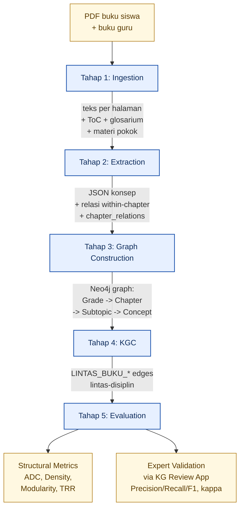
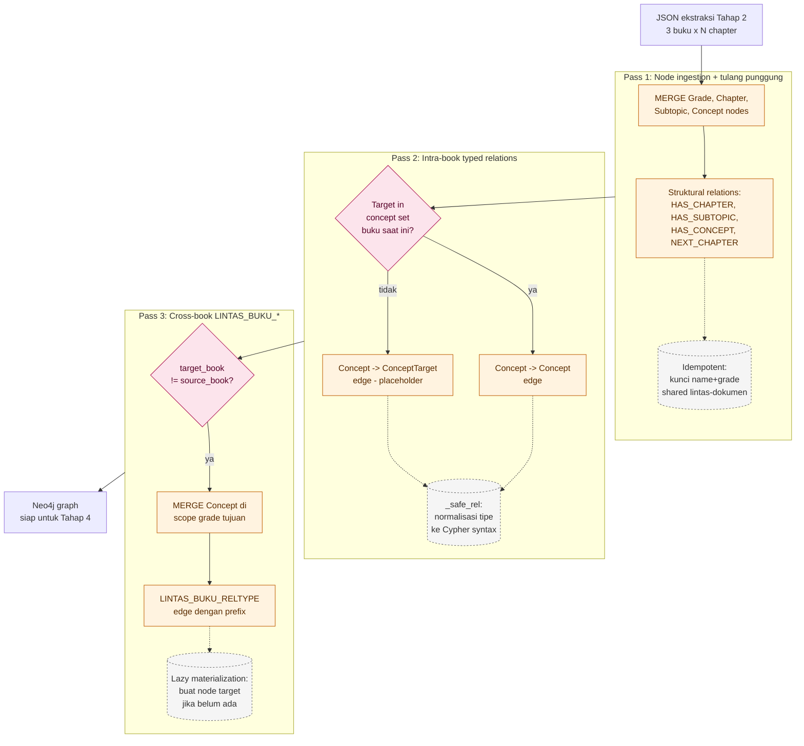

# Bab 4 Dev — Methodology Diagrams (Mermaid)

Three flowchart diagrams to drop into the **Bab 4 Dev** tab of the thesis doc.
All render natively in Google Docs (paste as text → it becomes editable),
in GitHub, in JupyterLab/VS Code, and in any modern Markdown viewer.

For the live Google Doc: paste as a code block, then insert a rendered PNG
exported from [mermaid.live](https://mermaid.live) underneath. Caption the
PNG with `Gambar 3.X` and reference it in the prose.

---

## Gambar 3.A — Pipeline 5 Tahap (overview)

Top-down flowchart of the full pipeline from PDF input to expert-validated
knowledge graph. Replaces the table at the top of Bab 4 Dev with a visual.



---

## Gambar 3.B — Strategi MERGE Tiga-Pass (Tahap 3 detail)

Detailed view of Tahap 3 — explains the Concept vs ConceptTarget split and
the per-pass guarantees (idempotency, forward-reference handling, lazy
materialization). The prose in Bab 4 Dev currently describes this in 4
paragraphs; the diagram makes the algorithm visually obvious.



---

## Gambar 3.C — Pipeline KGC (Tahap 4 detail)

Detailed view of Tahap 4 — the thesis's core methodological contribution.
Shows embedding → vector index → ANN retrieval → pruning → LLM-as-classifier
with closed vocabulary → writeback. Includes the KONTEKS GRAF block fed to
the classifier as evidence (this is the differentiator from prior LLM-only
completion methods).

```mermaid
flowchart LR
    NODE[Concept dengan<br/>description, grade,<br/>materi_pokok_ref] --> EMB[Embed:<br/>name + description<br/>+ materi_pokok_ref<br/>+ grade]
    EMB --> VEC[Store as<br/>Concept.embedding<br/>+ vector index<br/>cosine, HNSW]
    VEC --> ANN[ANN top-k<br/>per Concept]

    ANN --> FILTER{Pruning filters}
    FILTER -->|cross-grade only| F1
    FILTER -->|skip existing<br/>typed edges| F1
    FILTER -->|dedupe<br/>undirected pairs| F1[Candidate pairs<br/>sim >= threshold]

    F1 --> CTX[Build KONTEKS GRAF:<br/>parent Bab<br/>+ typed out-edges<br/>+ shared neighbors]

    CTX --> LLM[LLM classifier<br/>Gemini 2.5 Flash<br/>temperature=0.2<br/>response_schema enum]

    LLM --> VOCAB{Closed vocab<br/>5 LINTAS_BUKU_*<br/>atau NONE}
    VOCAB -->|valid + conf >= 0.7| WB[Write LINTAS_BUKU_*<br/>edge to Neo4j]
    VOCAB -->|NONE / low conf| DROP[Drop pair]

    WB --> DUMP[Stage to<br/>lintas_buku_edges.json<br/>friend-llm format]
    DUMP --> REPLAY[replay_completion.py<br/>MERGE ke Neo4j]

    classDef step fill:#e3f2fd,stroke:#1565c0,color:#0a3266
    classDef decision fill:#fce4ec,stroke:#ad1457,color:#560027
    classDef output fill:#e8f5e9,stroke:#2e7d32,color:#1b3a1f
    classDef drop fill:#fafafa,stroke:#999,color:#666,stroke-dasharray:3 3

    class NODE,EMB,VEC,ANN,F1,CTX,LLM step
    class FILTER,VOCAB decision
    class WB,DUMP,REPLAY output
    class DROP drop
```



---

## How to use these in the thesis

1. **Inline preview**: paste each ```mermaid``` block directly into the Google
   Doc. Docs renders it as plain text in monospace — preserves source for any
   re-editing.

2. **Rendered figures**: open [mermaid.live](https://mermaid.live), paste the
   diagram, export as PNG (transparent background, 2x scale for print). Insert
   the PNG as `Gambar 3.A` / `3.B` / `3.C` directly under the source block.

3. **Caption convention** (match existing thesis style):
   - `Gambar 3.A Pipeline 5 Tahap KG Construction & Completion`
   - `Gambar 3.B Strategi MERGE Tiga-Pass pada Tahap Konstruksi Graf`
   - `Gambar 3.C Detail Pipeline Knowledge Graph Completion (KGC)`

4. **Reference in prose**: replace passages like *"Sistem dibangun dengan
   arsitektur pipeline 5 tahap..."* with `... lihat Gambar 3.A`.

---

## Editing notes

- Mermaid syntax intentionally avoids special characters that confuse Google
  Docs paste (no `→`, no emoji — replaced with `->` and ASCII).
- Colors use a 3-class palette: stage/process (blue), decision/branch (pink),
  output/artifact (green/yellow). Re-styleable via the `classDef` lines at
  the bottom of each diagram.
- If a diagram exceeds page width when rendered, the `flowchart TB` (top-bottom)
  vs `flowchart LR` (left-right) directive in the first line controls aspect.
