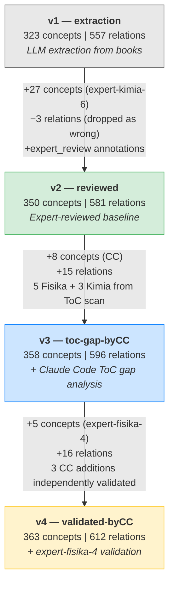
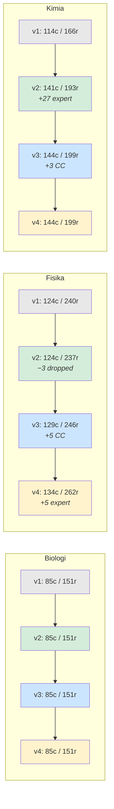
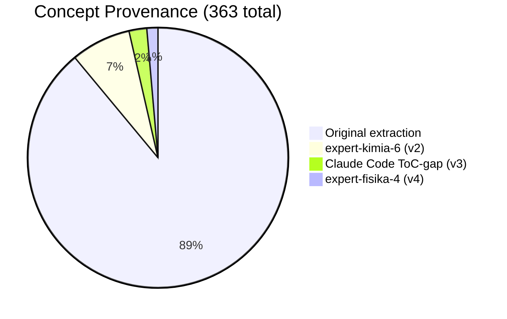

# KG Extraction State Evolution

## Flow

## Per-Subject Breakdown

## Delta Summary

| Version | Source | Concepts | Relations | Key Action |
|---------|--------|----------|-----------|------------|
| **v1** | LLM pipeline | 323 | 557 | Yhoga's extraction from PDF books |
| **v2** | + expert review | 350 (+27) | 581 (+24) | expert-kimia-6 added 27; 3 Fisika dropped as wrong |
| **v3** | + Claude Code | 358 (+8) | 596 (+15) | ToC-vs-KG gap scan: Inframerah, Relativitas x4, Stoikiometri, Perbandingan Sel, Mobil Listrik |
| **v4** | + expert-fisika-4 | 363 (+5) | 612 (+16) | Muatan Kapasitor, Alat Ukur, Efisiensi Trafo, Nilai Efektif AC, Dualisme Gelombang-Partikel + 6 formula relations |

## Provenance Composition (v4)

## Validation Status

| Reviewer | Subject | Triples Rated | Correct | Issues |
|----------|---------|---------------|---------|--------|
| expert-biologi-1 | Bio | partial | -- | incorporated in v2 |
| expert-biologi-6 | Bio | partial | -- | incorporated in v2 |
| **expert-biologi-4** | Bio | **151/151** | **100%** | 2 cosmetic comments |
| expert-fisika-6 | Fisika | partial | -- | incorporated in v2 |
| **expert-fisika-4** | Fisika | **240/240** | **99.6%** | 1 "missing" (description fix), 15 new triples proposed |
| expert-kimia-6 | Kimia | partial | -- | incorporated in v2, proposed 27 additions |
| expert-fisika-2-kimia | Kimia | partial | -- | incorporated in v2 |

## CC Validation Highlight

3 of 5 Claude Code ToC-gap additions were **independently proposed** by expert-fisika-4 (who reviewed the v1 extraction without seeing CC's work):

- Pemanfaatan Inframerah
- Dilatasi Waktu
- Penambahan Kecepatan Relativistik
